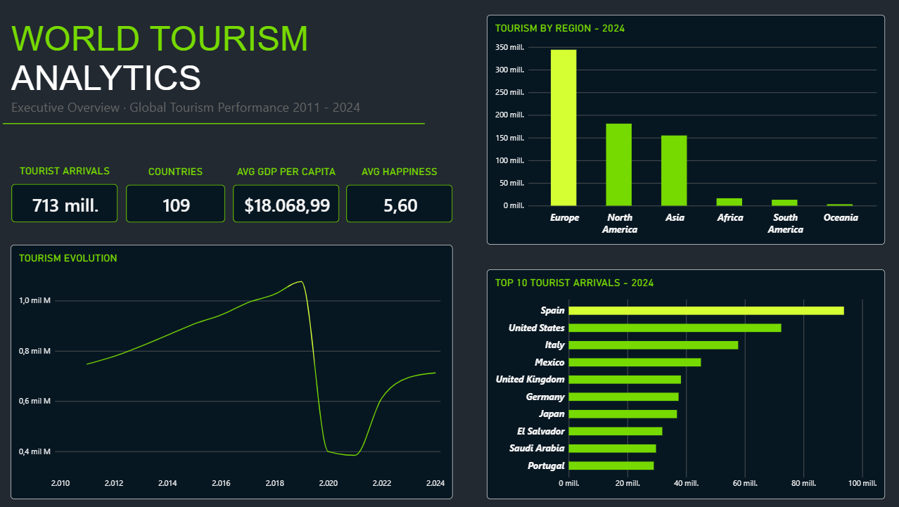

# World Tourism Analytics

**An end-to-end data analytics project exploring international tourism growth, recovery patterns and the relationships between tourism and selected economic, social and cultural indicators.**

## Business Question

Which countries are experiencing the strongest tourism growth, and which factors are associated with higher international tourist arrivals?

## Project Overview

This project integrates six datasets into a PostgreSQL Data Warehouse to analyze tourism performance across countries and years.

The workflow covers data preparation, dimensional modelling, SQL transformations, exploratory data analysis and interactive visualization.

## Tools & Technologies

- **Excel & Power Query:** data auditing, cleaning and standardization.
- **PostgreSQL & DBeaver:** Data Warehouse design, data integration and SQL analysis.
- **Python & Google Colab:** exploratory data analysis (EDA), visualizations and correlation analysis.
- **Power BI:** interactive dashboards and business insights.
- **GitHub:** project version control and documentation.

## Data Warehouse Architecture

The Data Warehouse follows a three-layer architecture:

- **Staging:** source datasets loaded into PostgreSQL.
- **Core:** dimensional model containing `fact_country_profile` and the associated dimensions.
- **Analytics:** SQL views designed to support analytical queries.

The fact table is designed around a grain of **one country per year**, covering the period **2011–2024**.

## Power BI Dashboard

The dashboard contains three analytical pages:

### 1. Executive Overview
Provides a high-level view of tourist arrivals, country coverage, economic and happiness indicators, tourism evolution and regional distribution.

### 2. Tourism Analysis
Examines tourism growth, identifies the fastest-growing countries and compares tourism recovery patterns between 2018 and 2024.

### 3. Tourism Drivers
Explores the relationships between tourist arrivals and UNESCO World Heritage site counts, happiness scores and peace scores.

## Exploratory Data Analysis

The 2024 correlation analysis identified the following associations with tourist arrivals:

| Variable | Correlation |
|---|---:|
| GDP per capita | 0.30 |
| Happiness score | 0.28 |
| Peace score | -0.20 |

These results indicate weak linear relationships in the analyzed data. Correlation does not imply causation, and additional variables would be needed to investigate the wider drivers of international tourism.

**Peace score interpretation:** lower scores indicate greater peace.

## Data Sources

The project combines international tourism arrivals data with indicators related to GDP per capita, population, happiness, peace and UNESCO World Heritage sites.

The datasets have different source periods and country coverage. The integrated analytical model focuses on 2011–2024, according to the availability and alignment of the selected indicators.

## Repository Structure

- `csv/` — cleaned datasets in CSV format.
- `data_clean/` — cleaned Excel datasets.
- `notebooks/` — project documentation.
- `python/` — exploratory data analysis notebook.
- `powerbi/` — Power BI dashboard.
- `sql/` — scripts for dimensions, staging, core loading and analytics views.

Original datasets are maintained separately in the local `data_raw/` folder and are not included in this repository.

## Project Outcome

This project demonstrates an end-to-end analytics workflow, from data preparation and relational data modelling to exploratory analysis and business intelligence reporting.
